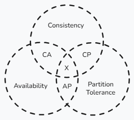

+++
date = '2026-03-17T19:00:40-03:00'
draft = true
title = 'Um Novo Projeto - Muitas Decisões!'
tags = ['design de sistemas', 'engenharia de software', 'padrões de projetos', 'arquitetura']
+++

## Cenário ##
Então você está está em uma reunião de refinamento técnico. Juntamente com o time, estão exatamente em um momento de definições para a nova solução que estão implementando. Alguns defendem o uso de um banco de dados relacional, outros levantam a bandeira do não relacional. Monolito, monolito modular ou partirmos de microserviços? E então, chega o seu momento de entrar na discussão e dar sua opnião sobre o tópico banco de dados... 

* Quais parâmetros você analizaria para dar sua sugestão? 

* Quais fundamentos traria para mesa para apoiar sua ideia? 

* Confiaria apenas na sua intuição, experiência e mantendo-se em sua zona de conforto, apenas diria: 

* "Acredito que o banco de daos 'xyz' vai atender as nossas necessidades, afinal já temos esse banco rodando em nosso projeto..." ? 

## E agora? ##
Sim, essa é uma situação muito comum entre times de engenharia de software onde muitas vezes, decisões são tomadas sem uma consideração apurada e sem uma base sólida, levando a decisões que poderiam ser melhores. 

Especialmente quando falamos de dados em sistemas distribuidos, existem alguns fundamentos que nos ajudam a definir os prós e contras de decisões técnicas em projetos de engenharia de software.

Nesse artigo vamos explorar alguns desses conceitos, sendo os seguntes:

* Teorema CAP
* ACID
* BASE
* PACELC

Esses são fundamentos base, modelos conceituais teóricos que engenheiros de software precisam ter dentro de sua caixa de ferramentas para se aprofundar em patterns arquiteturais mais complexos e tomarem decisões de ponta a ponta em seus projetos. Após entender o que são e como utiliza-las no dia a dia, conseguiremos ter uma base sólida para tomadas de decisão. 

## Introdução ao Teorema CAP ##

Se tem uma verdade em engenharia de software bem definida é:

"_Não existe almoço grátis_".

Bem, e é nesse contexto que o teorema CAP é de grande ajuda. Mas afinal o que é o teorema CAP? 
O teorema CAP é um modelo conceitual, tendo a definição de seu acrônimo como:

* C - Consistency -> Consistência
* A - Availability -> Disponibilidade
* P - Partition tolerance -> Tolerância a partições

Esse teorema serve para que consigamos considerar decisões arquiteturais que vão variar dentre os seus três pilares, consistência, disponibilidade e tolerância a partições. A proposta do teorema CAP na pespectiva de banco de dados distribuído é que apenas será possível escolher dois de seus três atributos. Uma forma simples para entender isso é pensar na ideia de escolha 2 dentre as 3 opções: bom, barato e rápido:

* Se for **bom** e **barato**, não será rápido. 
* Se for **rápido** e **bom**, não será barato. 
* Se for **barato** e **rápido**, não será bom. 

Seguindo essa lógica levando-se em conta o teorema CAP, se o banco de dados tiver:
* **Consistência** e **tolerância a partição**, ele não priorizará **disponibilidade**.
* **Disponibilidade** e **consistência**, ele não priorizará **tolerante a partições**. 
* **Disponibilidade** e **tolerância a partições**, ele não priorizará a **consistência**. 

Dessa forma, o teorema CAP nos ajudar a entender as limitações que são, em geral, encontradas em qualquer banco de dados. Da pespectiva do teorema CAP então, bancos de dados em sistemas distribuídos não conseguem atingir as suas três propriedades ao mesmo tempo. Para que consingamos nos aprofundar ainda mais nesses tópicos, precisamos entender alguns outros conceitos. 

## ACID ##

Assim como CAP, ACID também é um acrônimo. O seu significado é:
* A - Atomicity -> Atomicidade
* C - Consistency -> Consistência
* I - Isolation -> Isolamento 
* D - Durability -> Durabilidade

Podemos dizer que, bancos de dados que são "ACID", na verdaes são bancos que suportam operações transacionais que são processadas de forma atômica e confiável mas que por sua vez podem acabar deixando de lado outras propriedades, visto que **sempre teremos de abrir mão de um benefício para obtermos outro**. Nesse cenário podemos usar como exemplo os bancos de dados SQL tradicionais, visto que suas transações e consistência tem prioridade diante a disponibilidade e performânce. 

### Atomicidade ###

_Escrito por humano - **Cris**_