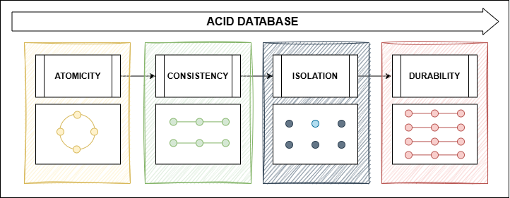

+++
date = '2026-03-17T19:00:40-03:00'
draft = true
title = 'Um novo projeto - Muitas decisões!'
tags = ['engenharia de software', 'design de sistemas','padrões de projetos', 'arquitetura']
+++

## Cenário ##
Então você está está em uma reunião de refinamento técnico. Juntamente com o time, estão exatamente em um momento de definições para a nova solução que estão implementando. Alguns defendem o uso de um banco de dados relacional, outros levantam a bandeira do não relacional. Monolito, monolito modular ou partirmos de microserviços? E então, chega o seu momento de entrar na discussão e dar sua opnião... 

* Quais parâmetros você analizaria para dar sua sugestão? 

* Quais fundamentos traria para mesa para apoiar sua ideia? 

* Confiaria apenas na sua intuição, experiência e mantendo-se em sua zona de conforto, apenas diria: 
    * "Acredito que o banco de daos 'xyz' vai atender as nossas necessidades, afinal já temos esse banco rodando em nosso projeto..." ? 

## E agora? ##
Pois bem, essa é uma situação muito comum entre times de engenharia de software onde muitas vezes, decisões são tomadas sem uma consideração apurada e sem uma base sólida, levando a decisões que poderiam ser melhores. 

Para nos ajudar a solucionar esse cenário temos algumas ferramentas que nos ajudam a definir os prós e contras na hora de decidir exatamente qual tipo de banco de dados implementar em um projeto. 

Vamos explorar os conceitos sobre os seguintes tópicos:

* ACID
* BASE
* Teorema CAP
* PACELC

Esses são fundamentos base que engenheiros de software precisam ter dentro de sua caixa de ferramentas para tomarem decisões ao projetarem soluções e nos aprofundar em patterns arquiteturais mais complexos definirem qual modelo de banco de dados usar em seus projetos. Após entender o que são e como utiliza-las no dia a dia, conseguiremos ter uma base sólida para tomadas de decisão. 

## ACID ##

_Escrito por humano - **Cris**_